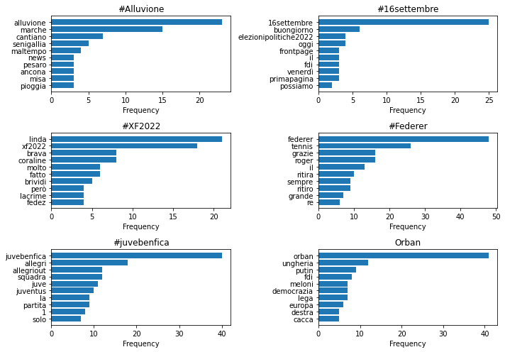
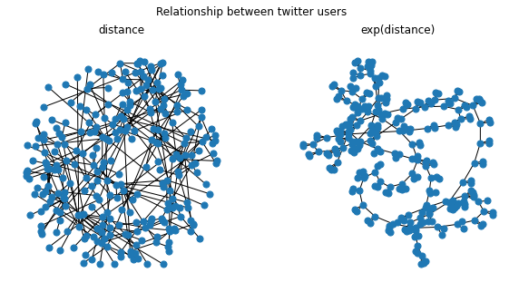

# Twitter API in Python
Some tests and experiments with Twitter API in Python, by Tweepy. During my holidays I tried to explore some very simple Natural Language Processing and Graph Theory tools, paying attention to inductive and algorithmic biases.
Unfortunately it hasn't aged well due to Twitter's new 2023 policies.

## Trend Analysis
First section of the notebook will search for trend topics in a given area (done for Italy, WOEID=23424853) and show the most common words linked to them.
Here's the result for September 16th, 2022.

  

### Most important inductive biases of this analysis:
> result_type attribute of api.search_tweets function is set to "mixed", so the analysis will include both "popular" and "recent" tweets.

> This analysis does not consider retweets. You could be interested in a system of weights based on popularity. 

### (Some of the many possible) improvements: 
> Stop words should be extended

> Should be better investigated the time dependence of results and what's the best amount of tweets to be considered. 

> Would be interesting to combine this simple code with some ML tool for sentiment analysis.

## Networks and graphs
This section will show relationships between twitter users quantified by a given function and it's my very first attempt to do some basic network analysis. 
The distance between two users is here based on people who both follow. It's quantified by the following formula:
$$dist(user_1, user_2) = \frac{count(F_1 \cap F_2)}{count(F_1)+count(F_2)-count(F_1 \cap F_2)}$$
where $F_i$ indicates users followed by $user_i$.

The algorithm is pretty simple: get a user id (starting id is mine), choose  k  random twitter friends, calculate the distances, choose a random user between the three friends, iterate the process  i  times.
Runtimes are long because the twitter rate limitations. Save the Pandas DataFrame as a .csv file is useful to continue the analysis in different sessions and cumulate the results.

  

### Most important inductive biases:
> Of course the definition of distance between users.

> The two hyperparameters that manage the for cycle: $i$ number of iterations, $k$ friends choose for iteration. 

> The random.sample algorithm.

### (Some of the many possible) improvements:
> Should be better investigate the rule of hyperparameters.

> This approach is very time expensive in order to get some significant results. Might be better to use a more structured sample algorithm. 

> In general, I have an approximately zero experience with networks and that was only a game during my holidays. 
